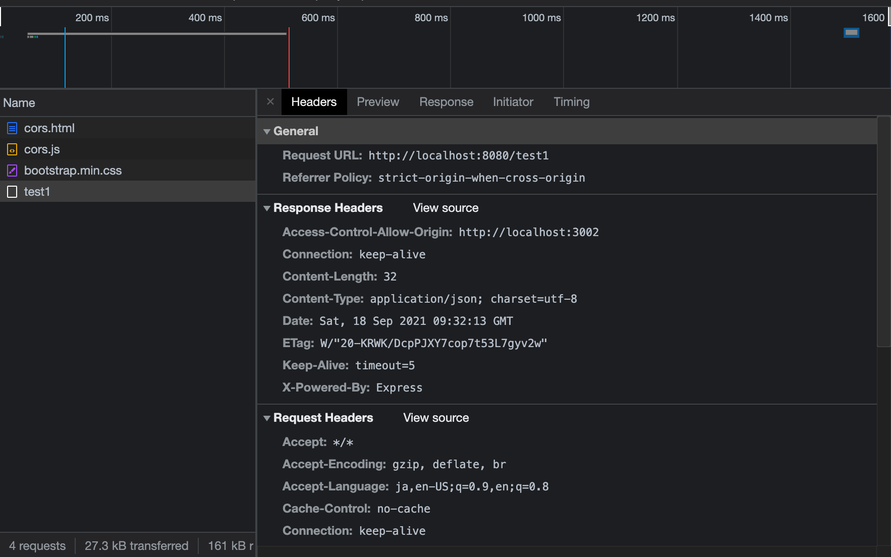
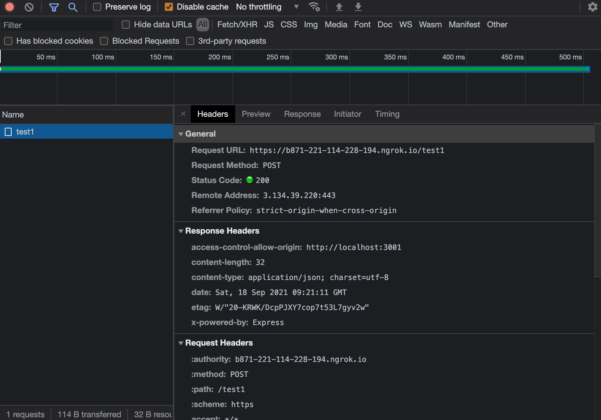
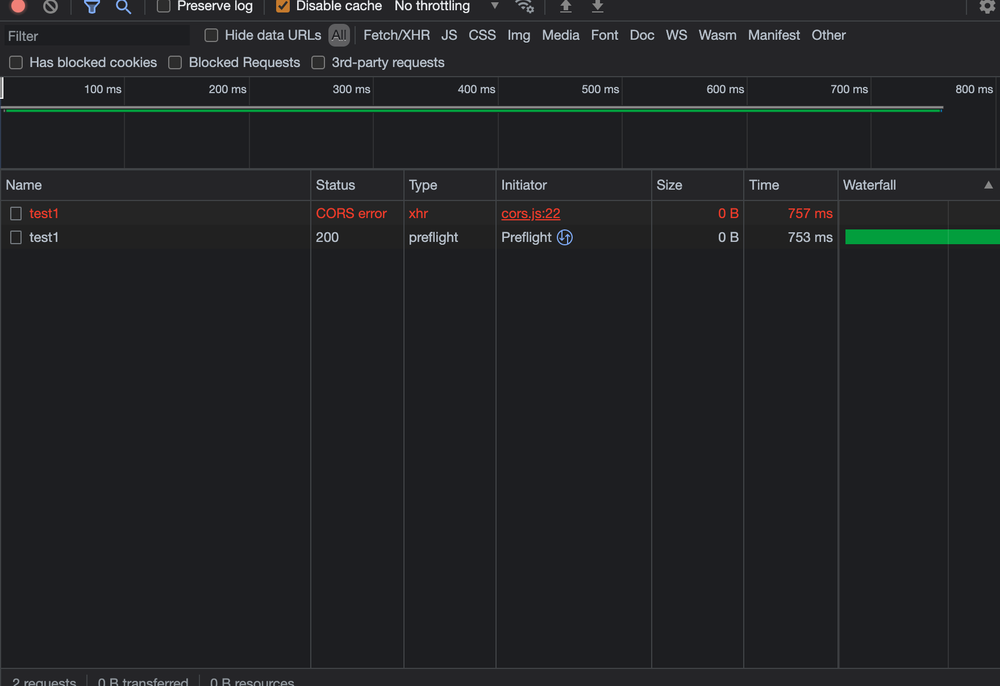

## 結果

# 特定のオリジンからのPOSTリクエストのみ許可
responseServer.jsのres.set('Access-Control-Allow-Origin', ' http://localhost:3001');
で特定のオリジンのみからアクセスを許可できるように変更

# Simple requestはpreflightが行われない

# Simple requestに該当しないときはpreflightが行われる
